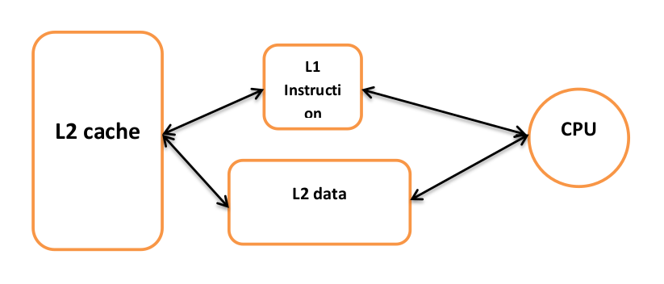
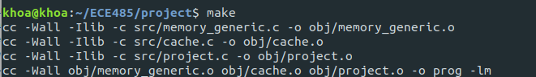
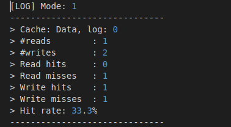

# projectECE485 Cache simulation
Author: Nguyen Huynh Dang Khoa (aka Victor Nguyen), Nguyen Thi Minh Hien  

May-June 2020
Mayjor: Embedded System - Computer Science
University: Danang University of Sciences and Technology  
## About
- This project is about cache design and simulation. The goal is to design and similate 2 L1 caches: instruction cache and data cache which are backed by a shared L2 cache.  

- Instruction cache specification: 2-way associative, 16K sets, 64-byte line.
- Data cache specification: 4-way associative, 16K sets, 64-byte line.
- Both cache use LRU replacement policy, the order of cache is inclusive.
## How to install
- Dependency: You should use Linux environment, such as Ubuntu, MacOS for best experience.  
- Clone this directory by git clone or Download the zip.
- Go into /project directory. 
- Open terminal and "make" the project.  

- If there is any error, try "make clean" and then "make" again.

## How to use
- After make the project, you should have an execution file named "prog". We will use this file to run.
- Syntax: ./prog (trace_file_name) (mode(optional)).  
          example: ./prog trace.txt  
                   ./prog trace_data.txt 1  
                   ./prog trace_evict.txt 2
- trace_file_name: name of your trace file. Here we have already some .txt file to make sure you can use them to test our system.
- Mode: mode 1 will just print the statistic of 2 cache to log file, nothing else.  
        mode 2 is similar to mode 1, but it also prints communication message with L2 cache.
- If you want to delete all log file:  
        make clear
- After running the file, the result log file should be like this:   

## Troubleshoot
- If there is any trouble, please feel free to contact with me via email: khoanguyen1507vn@gmail.com.

## Hope you like this !!!

